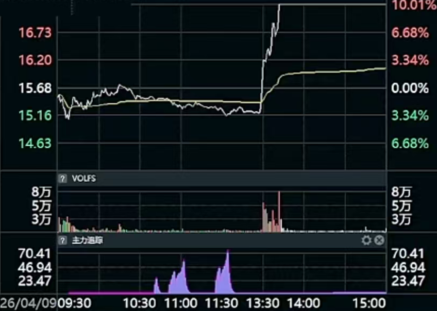
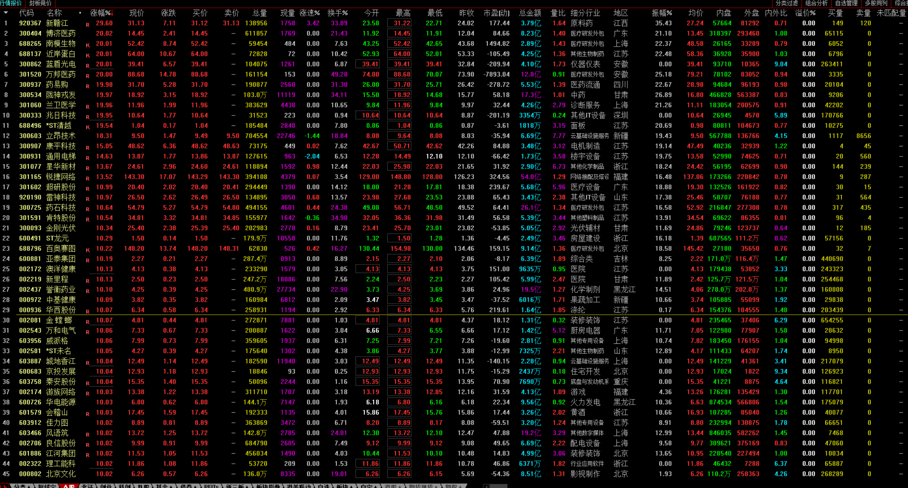
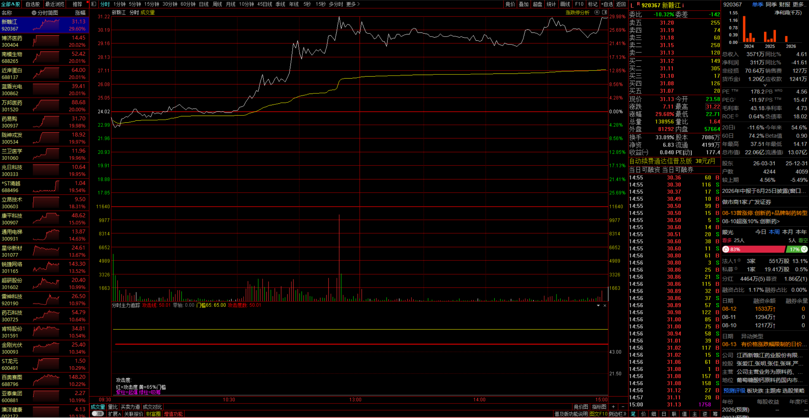

# PRD：个股主力追踪系统

> 版本 v0.2 | 状态：评审中 | 负责人：产品 | 关联 Sprint 1-2

## 1. 背景与目标

- **背景**：个人投资者盘中需要实时盯主力资金动向，现有工具（同花顺/东财 App）数据分散、无法批量盯盘、不易二次分析。
- **目标**：提供一个免安装的网页工具，开盘期间实时展示个股**分时走势、VOLFS 量能、主力资金追踪**，并支持**股票搜索、历史K线**、**本地通达信历史数据**。
- **非目标**：不做下单交易；不做多日因子回测（Sprint 4 再议）。

## 2. 目标用户与场景

| 用户 | 场景 |
|---|---|
| 个人短线/波段投资者 | 盘中判断个股主力是否净流入、量能是否放大 |
| 量化爱好者 | 拉取分钟级资金流数据做后续分析 |

## 3. 功能需求（EARS）

### Ubiquitous（系统始终满足）
- R-U1 The system shall 使用黑底股票通用显示模式渲染个股行情（分时/量能/资金三面板 + K线面板）。
- R-U2 The system shall 按优先级使用数据源：腾讯自选股首选，东财兜底，通达信本地历史，npx 离线补全。
- R-U3 The system shall 将运行日志写入 logs/deepthink_YYYYMMDD.log。

### Event-driven（事件驱动）
- R-E1 When 页面加载完成，the system shall 立即拉取当前个股分时、成交量、主力资金数据并渲染。
- R-E2 When 用户在搜索框输入关键词，the system shall 200ms 内返回匹配标的列表（代码/名称/行业模糊匹配）。
- R-E3 When 用户点击/回车选中搜索结果，the system shall 切换标的并刷新全部面板。
- R-E4 When 用户双击分时面板或在分时面板按 Enter，the system shall 切换到该标的的历史K线视图。
- R-E5 When 用户在K线视图切换周期（日/周/月/60/30/15/5分），the system shall 加载对应周期K线并重绘。
- R-E6 When 数据源不可用（腾讯失败），the system shall 自动降级到东财接口并在日志记录。

### State-driven（状态驱动）
- R-S1 While 页面处于分钟视图，the system shall 每 30 秒自动刷新一次行情数据。
- R-S2 While 非交易时段（周末/盘前盘后），the system shall 展示最近收盘数据并提示"休市中"。
- R-S3 While 请求日/周/月K线，the system shall 优先从本地通达信 .day 读取（0.01s），无本地数据时降级 npx。
- R-S4 While 请求分钟K线，the system shall 优先读取本地 JSON 缓存（24h 有效），未命中时 npx 拉取并写缓存。

### Unwanted（异常处理）
- R-U4 If 单个数据源请求失败，then the system shall 记录错误日志并尝试兜底源，不中断页面。
- R-U5 If 返回数据为空或格式异常，then the system shall 显示"数据获取失败"占位并保留上次数据。
- R-U6 If 东财接口被限流（HTTP 4xx/5xx 或超时），then the system shall 自动切换 push2delay 节点并延迟重试。
- R-U7 If 通达信本地 .day 文件缺失或损坏，then the system shall 静默降级到 npx/东财，不影响页面。

### Optional（可选）
- R-O1 Where 用户维护了自选列表，the system shall 支持批量刷新并显示涨跌幅摘要（Sprint 3）。✅
- R-O2 Where 用户需要，the system shall 提供分时明细表（逐分钟价格/均价/量/主力净额）（Sprint 3）。✅
- R-O3 Where 用户需要，the system shall 提供近 N 日主力净流入柱状对比，以便判断资金趋势（Sprint 4）。✅
- R-O4 Where 主力净流入短时间大幅异动，the system shall 高亮提示（Sprint 4）。✅
- R-O5 Where 用户需要，the system shall 导出分时/资金/K线数据为 CSV（Sprint 4）。✅

## 4. 界面说明

> **参考样式**（来自同花顺/东财通用显示模式）：
> - 主力追踪三面板（分时 + VOLFS + 主力资金）
> - 股票列表页（全市场密集表格）
> - 分时详情页（自选 + 主图 + 副图 + 买卖档）

### 4.1 分钟视图（默认）
```
┌─────────────────────────────────────────────┐
│ 顶部：股票名 代码 现价 涨跌% [自选▾][搜索框] [K线]│
├─────────────────────────────────────────────┤
│ ① 分时面板  现价白线 / 均价黄线（双击→K线）     │
├─────────────────────────────────────────────┤
│ ② VOLFS    每分钟量柱（红涨绿跌）             │
├─────────────────────────────────────────────┤
│ ③ 主力追踪  主力净流入累计（紫色面积）          │
├─────────────────────────────────────────────┤
│ ④ 资金博弈  主力净额紫柱 / 散户净额绿线        │
└─────────────────────────────────────────────┘
  右侧栏（与左图等高，对齐资金博弈底框）：
  ┌──────────────┐
  │ 五档盘口（卖5→买5）│
  │ 现价大字 + 涨跌色块 │
  │ 16 项指标（2组/行）│
  │ ⏱ 时间戳 HH:MM:SS│
  ├──────────────┤
  │ 选中分钟列表（240 行）│
  │ ↑↓/点击切换，蓝底高亮│
  └──────────────┘
```

### 4.2 K线视图
```
┌─────────────────────────────────────────────┐
│ K线图 贵州茅台 日K 260根  [日K][周K][月K][60分]…[返回分时]│
├─────────────────────────────────────────────┤
│ 主图：K线蜡烛 + MA5/10/20                   │
├─────────────────────────────────────────────┤
│ 副图：VOL 成交量（红涨绿跌）                 │
└─────────────────────────────────────────────┘
```

## 5. 数据接口

| 数据 | 首选 | 兜底 | 说明 |
|---|---|---|---|
| 报价/分时 | 腾讯 ifzq.gtimg.cn / qt.gtimg.cn | 东财 trends2 | 盘中实时 |
| 主力资金 | 东财 fflow/kline/get (push2) | 东财 push2delay | 腾讯公开接口无 |
| 日/周/月 K | **通达信本地 .day** | npx → 东财 | 0.01s，含全历史 |
| 分钟 K | npx westock（+本地缓存） | 东财 kline | 首次 2s，缓存后秒开 |
| 搜索 | ✅ 全 A 股 5549+ 本地 JSON + 拼音（stock_list.py） | — | 代码/名称/拼音首字母 |

输出统一 JSON：`{ code, name, price, pre_close, minute: [{t, price, avg, vol}], fund: [{t, main}], errors: [] }`

## 6. 数据指标（验收口径）

- 分时价格/均价与腾讯行情**一致（±0.01 元）**
- 主力净流入 = 超大单 + 大单净流入，与东财口径一致
- 页面刷新间隔误差 ≤ 3s
- 双源切换成功率：断开腾讯后 10s 内降级成功
- 本地通达信日/周/月 K 加载 ≤ 100ms
- 分钟 K 缓存二次加载 ≤ 100ms

## 7. 验收标准

见 `sprint-1.md` / `sprint-2.md` DoD 清单。

## 8. 待确认问题

1. 自选列表初始放哪些标的？（暂定 sh600519 + sz000858 + sz300750 + sh601318）
2. 是否要支持港股/美股？（本期仅 A 股）
3. 主力口径以"超大单+大单"还是以腾讯"主力"字段为准？（暂定东财口径）
4. 通达信本地数据滞后（需用户手动"盘后数据下载"），是否需要自动合并 npx 最新 K 线？（建议 Sprint 3）

- R-E9 When 用户双击K线或按Enter，the system shall 弹出该日历史分时小图（免费源约30天内），否则提示无数据。
- R-E10 When 分时图渲染，the system shall 右侧展示五档盘口信息卡（卖5→卖1/现价/买1→买5 + 开高低/换手/振幅/时间）。
- R-E11 When 用户hover任意K线，the system shall 信息卡显示该日 开盘/收盘/最低/最高/昨收/涨幅/振幅/成交额。
- R-E12 When 用户在搜索框输入纯6位数字，the system shall 按首位猜市场前缀并同步探测真实中文名。
- R-E13 When 用户在分时视图按方向键 ↑/↓，the system shall 切换选中分钟并在右侧列表高亮该分钟详情（时间/价格/每分成交量/每分成交额）。
- R-E14 When 分时视图渲染 VOLFS，the system shall 按该分钟价格涨跌方向染色（A 股惯例：红涨绿跌），而非按主力资金流方向。
- R-E15 When 五档盘口信息卡渲染，the system shall 展示 16 项指标（现价/今开/涨跌/最高/涨幅/最低/总手/量比/外盘/内盘/换手/股本/净资/流通/收益/PE），时间戳格式 HH:MM:SS。
- R-E16 When 用户点击顶部自选下拉，the system shall 展示 5549+ 可选标的（全 A 股 + 拼音首字母），支持输入模糊搜索。
- R-E17 When 分时视图渲染，the system shall 左侧栏底部展示"市场综合"面板（行情+估值+市值+财务+年度净利柱状图+股东户数+融资融券+龙虎榜+公司信息+盈利预测+主力多空+公告），各组紧凑排列，数据源失败该组隐藏。
