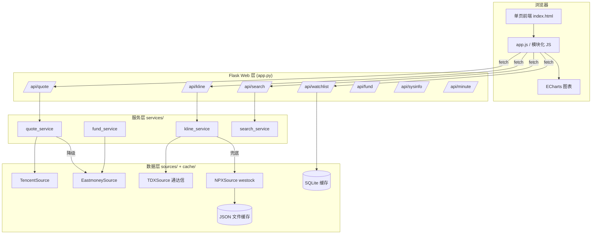

# 个股主力追踪系统 · 架构规划

> 版本 v1.0 | 架构师评审稿 | 关联 Sprint 1-3
> 定位：从"单文件快速验证"演进为"可扩展的行情分析平台"

## 1. 架构目标与原则

| 目标 | 说明 |
|---|---|
| **可扩展** | 新增数据源/指标/标的类型不改核心，只加适配器 |
| **数据源容灾** | 腾讯（首选）→ 东财（兜底）→ 通达信本地（历史）→ npx（离线补全），四级降级 |
| **本地优先** | 历史 K 线本地化（通达信 .day + SQLite 缓存），减少网络依赖 |
| **前后端分离** | Flask 只做 API，前端独立演进（组件化，不依赖后端渲染） |
| **可测试** | 数据层纯函数化，可单测；数据源适配器可 mock |

**设计原则**
- 单一职责：一个模块只做一件事
- 依赖倒置：Service 依赖 Source 抽象接口，不依赖具体实现
- 配置驱动：数据源开关/优先级/TTL 全部走配置
- 不引入重型框架：Flask + 原生 ECharts，保持轻量易维护

## 2. 总体架构图



**前端数据展示参考样式**（ECharts 黑底三面板，对标同花顺/东财）：


## 3. 目录结构（重构目标）

```
E:\AI_Studio\deepthinkSingle\
├── app.py                    # Flask 入口（thin，只注册路由）
├── config.py                 # 配置：数据源优先级 / TTL / 路径 / 端口
├── run.bat                   # 一键启动（先杀旧进程）
├── requirements.txt
│
├── services/                 # 服务层（业务逻辑，可单测）
│   ├── __init__.py
│   ├── quote_service.py      # 报价+分时（腾讯→东财降级）
│   ├── kline_service.py      # K线（通达信本地→npx，多周期聚合）
│   ├── fund_service.py       # 主力资金（东财，多节点）
│   ├── search_service.py     # 搜索（预置池→在线兜底）
│   └── cache_service.py      # SQLite + 文件双缓存统一封装
│
├── sources/                  # 数据源适配器（实现统一 Source 接口）
│   ├── __init__.py
│   ├── base.py               # Source 抽象基类 + 降级编排器
│   ├── tencent.py            # 腾讯自选股（分时/报价/K线）
│   ├── eastmoney.py          # 东方财富（主力资金/K线/分时）
│   ├── tdx.py                # 通达信本地 .day（历史日/周/月）
│   ├── npx.py                # npx westock-data-skillhub（兜底）
│   └── company.py            # 公司综合（公告/财务/股东）
│
├── static/
│   ├── css/style.css
│   └── js/
│       ├── charts/           # ECharts 图表封装（分时/VOLFS/主力/K线）
│       │   ├── minute.js
│       │   ├── volfs.js
│       │   ├── fund.js
│       │   └── kline.js
│       ├── components/       # UI 组件（搜索框/自选/视图切换）
│       │   ├── search.js
│       │   └── views.js
│       ├── api.js            # fetch 封装
│       └── main.js           # 入口（模块装配）
│
├── templates/index.html      # 页面骨架（引入模块化 JS）
├── data/                     # 运行时数据
│   ├── watchlist.json
│   ├── kline_cache/          # JSON 缓存（分钟K）
│   └── market.db             # SQLite（自选/历史K线/分析记录）
├── logs/deepthink_*.log
└── docs/                     # 敏捷文档
    ├── README.md
    ├── backlog.md
    ├── sprint-1.md
    ├── sprint-2.md
    ├── PRD.md
    └── architecture.md       # 本文档
```

## 4. 分层设计

### 4.1 Web 层（app.py，薄）
- 只做路由注册 + 参数校验 + JSON 序列化
- 业务逻辑全部委托 services/*
- 统一错误处理（返回 `{"error": "..."}`，HTTP 200 + error 字段，前端友好）

| API | 方法 | 参数 | 说明 |
|---|---|---|---|
| `/api/quote` | GET | code | 报价 + 分时 + 主力资金（一次拉齐）。quote 含 16+ 指标。附加：stats（60/360/今年涨幅+一年高/低）、finance（财务摘要）、holders（股东户数）、announcements（公告）、margin（融资融券）、lhb（龙虎榜）、company（公司信息）、forecast（盈利预测）、profit_trend（年度净利）、sentiment（主力多空） |
| `/api/kline` | GET | code, period, limit | 历史/分钟 K 线（limit<=0 返回全量，日/周/月不限制根数） |
| `/api/minute` | GET | code, date(YYYYMMDD) | 分时：缺省当日；填 date 拉历史某日（免费源约 30 天）。收盘后自动截断 15:00 后伪数据 |
| `/api/search` | GET | q | 股票搜索（纯数字自动猜前缀 + 探测真实中文名） |
| `/api/watchlist` | GET/POST | - | 自选 CRUD；GET 返回 watchlist + 全部预置池（115+ 项，含 in_watchlist 标记，前端 datalist 用） |
| `/api/fund` | GET | code | 主力资金明细（分钟级） |
| `/api/sysinfo` | GET | - | 环境/数据源状态 |

### 4.2 服务层（services/*）
- **quote_service**：拉报价+分时，`Source.get_quote()` → 失败降级 → 组装返回
- **kline_service**：`get_kline(code, period, limit)`，周期归一化，本地优先
- **fund_service**：主力资金（东财多节点轮询）
- **search_service**：预置池模糊匹配 → 在线搜索兜底
- **cache_service**：统一 `get(key, ttl, fetcher)`，SQLite 存结构化、JSON 存大数组

### 4.3 数据源层（sources/*，核心抽象）

```python
class Source(ABC):
    """统一数据源接口"""
    name: str
    @abstractmethod
    def get_quote(self, code) -> dict: ...
    @abstractmethod
    def get_minute(self, code) -> list: ...
    @abstractmethod
    def get_kline(self, code, period, limit) -> list: ...
    @abstractmethod
    def get_fund_flow(self, code) -> list: ...
```

**降级编排器（base.py）**：
```python
def with_fallback(sources, method, *args, **kwargs):
    """按优先级依次尝试，失败自动切下一源"""
    last_err = None
    for s in sources:
        try:
            return getattr(s, method)(*args, **kwargs)
        except Exception as e:
            last_err = e
    raise RuntimeError(f"全部数据源失败: {last_err}")
```

| 数据 | 优先级链 |
|---|---|
| 报价/分时 | Tencent → Eastmoney |
| 主力资金 | Eastmoney(push2) → Eastmoney(push2delay) |
| 日/周/月 K | TDX 本地 → NPX → Eastmoney |
| 分钟 K | NPX（+缓存）→ Eastmoney |
| 公告 | 东方财富 np-anotice-stock.eastmoney.com |
| 财务摘要 | 东方财经常 dataline emweb f10 RPT_F10_FINANCE_MAINFINADATA |
| 股东户数 | 东方财富 emweb f10 ShareholderResearch |
| 融资融券 | 东方财富 datacenter RPTA_WEB_RZRQ_GGMX |
| 龙虎榜 | 东方财富 datacenter RPT_DAILYBILLBOARD_DETAILSNEW |
| 盈利预测 | 东方财富 datacenter RPT_WEB_RESPREDICT |
| 公司信息 | 东方财富 emweb f10 CompanySurvey |
| 多空情绪 | 东财分钟资金流自计算（主力正负占比，近似舆情） |
| 搜索 | 预置池 → NPX search |

### 4.4 缓存策略

| 缓存 | 存储 | TTL | 说明 |
|---|---|---|---|
| 分钟 K 线 | JSON 文件 `data/kline_cache/` | 24h | 大数组，避免 npx 重复调用 |
| 自选列表 | JSON `data/watchlist.json` | 持久 | 用户数据 |
| 历史 K 线 | 通达信 .day（主）+ SQLite（辅） | 持久 | 本地权威 |
| 分析/复盘记录 | SQLite `market.db` | 持久 | Sprint 3 预留 |

SQLite 表设计（预留）：
```sql
CREATE TABLE kline_cache (
  code TEXT, period TEXT, ts INTEGER, data TEXT,
  PRIMARY KEY (code, period)
);
CREATE TABLE analysis_log (id INTEGER PRIMARY KEY, ts INTEGER, code TEXT, data TEXT);
```

## 5. 前端架构

**目标参考样式**（分时详情页：自选列表 + 主图 + 副图 + 买卖档多窗口）：


- **无构建方案**（保持 Flask 静态直出，免 Node 构建链）：
  - `static/js/` 分模块，`main.js` 用 `<script type="module">` 或简单命名空间加载
  - ECharts 图表封装成独立模块（minute/volfs/fund/kline 各一个函数）
  - UI 组件（search/views）独立文件
- **图表封装**：
  ```js
  // charts/kline.js
  export function renderKline(el, list, options) { ... }
  ```
  各图表模块只负责"数据 → ECharts option"，与数据获取解耦
- **状态**：main.js 维护 `state = { code, view, period }`，切换视图触发对应渲染

## 6. 关键设计决策

| 决策 | 选择 | 理由 |
|---|---|---|
| 历史 K 线 | 通达信 .day 本地优先 | 0.01s、含全历史、无网络依赖 |
| 分钟 K | npx + JSON 缓存 | 无稳定免费 HTTP 接口；缓存兜性能 |
| 主力资金 | 东财多节点 | 腾讯公开接口无此数据 |
| 缓存 | SQLite + JSON 双轨 | SQLite 结构化查询、JSON 大数组性能 |
| 前端 | 无构建 + 模块化 JS | 免构建链，保持简单可维护 |
| 并发 | Flask threaded（默认） | 单机自用足够，不引入 Celery |
| 配置 | config.py（非 .env） | 简单直白，注释友好 |

## 7. 测试策略

```
tests/
├── test_tdx.py        # .day 解析正确性（已知文件）
├── test_kline.py      # 聚合逻辑（日→周/月）
├── test_sources.py    # 数据源 mock 降级
└── test_api.py        # Flask 路由冒烟
```

关键可测点：
- `read_tdx_day`：首末条日期/价格正确
- `_aggregate`：周/月聚合 OHLC 正确
- 降级链：主源 mock 抛错 → 自动切备源

## 8. 演进路线（与 Backlog 对齐）

| 阶段 | 内容 |
|---|---|
| **Sprint 2（当前）** | 目录重构 + 分层落地 + 通达信本地化 + SQLite |
| **Sprint 3** | 自选批量表格（涨跌幅摘要）+ 分钟资金流明细 + 搜索在线兜底 |
| **Sprint 4** | 多日主力对比（日K资金柱）+ 主力异动告警 |
| **Sprint 5** | 复盘记录（SQLite）+ 数据导出 CSV |

## 9. 风险与对策

| 风险 | 对策 |
|---|---|
| 东财接口限流 | 多节点 push2delay + 请求节流 + TTL 缓存 + 熔断 |
| 通达信本地数据滞后 | npx 兜底补最新 + 提示用户"盘后数据下载" |
| npx 首次调用慢（下载包） | 预热缓存 + 后台异步加载 |
| 前端 JS 膨胀 | 模块化拆分（本轮执行） |
| 多实例端口冲突 | run.bat 启动前杀进程（已实现） |

---

## 10. 可延展性设计（Scalability & Extensibility）

> 目标：业务量增长、数据源/市场/指标扩展时，**核心代码零改动**或最小改动。

### 10.1 横向扩展点

| 扩展方向 | 现状 | 演进设计 |
|---|---|---|
| **多标的并发** | 单标的 30s 轮询 | `/api/quote?codes=a,b,c` **批量聚合接口**（服务端线程池/异步并发拉取，一次返回 N 只）；前端自选批量表格一次刷新 |
| **多市场** | 仅 A 股（sh/sz/bj） | `code` 前缀路由表：`sh/sz→A股源`、`hk→港股源`、`us→美股源`、`510xxx→ETF`；Source 按市场分发 |
| **多数据源** | 腾讯/东财/通达信/npx | `Source` 抽象 + 注册表，新增数据源只加一个 adapter，`config.py` 配置优先级 |
| **多周期/多指标** | MA5/10/20 + VOL | **指标引擎 `indicators/`**：MA/EMA/MACD/KDJ/RSI/BOLL 可插拔计算器（纯函数，输入 K 线数组输出指标序列），前端图表按需注册 |
| **多前端面板** | 分时/VOLFS/主力/K线 | **面板注册表**：`panels.register(name, renderer)`，新增面板不改 core |
| **部署形态** | 单机 Flask | 线程池 → gevent/异步 → 容器化（Docker）；批量接口幂等，可横向扩展实例 |

### 10.2 扩展隔离设计

```
用户请求
   │
   ├── market/              # 市场路由（新市场只加这里）
   │     ├── a_share.py     # sh/sz/bj → A股 Source 链
   │     ├── hk.py          # （预留）
   │     └── us.py          # （预留）
   │
   ├── sources/             # 数据源适配器（新数据源只加这里）
   │     └── tencent.py / eastmoney.py / tdx.py / npx.py / sina.py(预留)
   │
   ├── indicators/          # 指标引擎（新指标只加这里）
   │     ├── base.py        # Indicator 接口
   │     ├── ma.py / macd.py / kdj.py / rsi.py
   │     └── registry.py    # 指标注册表
   │
   └── panels/（前端）        # 面板注册表（新面板只加这里）
```

**扩展原则**
1. **注册表而非 if-else**：数据源/指标/面板都用注册表 + 配置驱动，新增项不动核心
2. **接口契约先行**：`Source`/`Indicator`/`Panel` 先定义接口，实现任意插拔
3. **批量接口设计**：`/api/quote?codes=` 聚合为单次往返，为自选批量/未来并发做准备
4. **数据管道解耦**：拉取（sources）→ 计算（indicators）→ 展示（panels），每层独立可测

### 10.3 批量聚合接口设计（自选批量）

```
GET /api/quote?codes=sh600519,sz000858,sz300750&fields=quote,minute,fund
```
- 服务端 `ThreadPoolExecutor(max_workers=8)` 并发拉取各标的
- 单个标的失败不影响其他（返回 `{code, error}` 条目）
- 响应 ≤ 300ms（8 并发 × 单源 50ms）
- 前端自选表格：一次 fetch 渲染 N 只涨跌幅 + 主力摘要

---

## 11. 稳定性设计（Stability & Reliability）

> 目标：数据源限流/超时/宕机时，系统**不雪崩、不中断、快速恢复**。

### 11.1 数据源稳定性（核心）

```
请求 → 熔断器(开/关/半开) → 限流器(令牌桶) → 数据源
          ↑ 连续失败≥N 次 → 熔断 T 秒     ↑ 超阈值 → 排队/降级
```

| 机制 | 实现 | 参数（config.py） |
|---|---|---|
| **超时控制** | 每请求独立 timeout（默认 5s）+ 总超时 10s | `TIMEOUT=5` |
| **熔断器** | 某源连续失败 5 次 → 熔断 60s（直接走备用源），半开后试探 | `CIRCUIT_FAILS=5` `CIRCUIT_RESET_S=60` |
| **限流** | 令牌桶：东财源全局 2 req/s，腾讯 5 req/s | `RATE_LIMIT` |
| **退避重试** | 失败后指数退避重试（1s/2s/4s），最多 3 次 | `RETRY_MAX=3` |
| **多节点轮换** | 东财 push2 → push2delay → push2his 自动轮换 | `EM_HOSTS` |
| **降级编排** | `with_fallback` 四级链（腾讯→东财→npx→本地缓存） | `SOURCE_CHAIN` |

### 11.2 缓存与一致性

| 策略 | 说明 |
|---|---|
| TTL 分层 | 报价 10s / 分时 30s / 资金 60s / K线 24h |
| 主动失效 | 自选变更/行情切换时主动清对应缓存 |
| 写穿缓存 | npx 拉取的分钟 K 写 JSON，通达信为权威日 K（不写回） |
| 降级缓存 | 数据源全挂时，返回**最近一次成功缓存**（stale-while-revalidate），页面不空 |

### 11.3 并发与进程

| 关注点 | 设计 |
|---|---|
| 线程安全 | 缓存读写加锁；Source 无状态（线程安全） |
| 单实例 | run.bat 先杀旧进程；端口检测 |
| 批量并发上限 | ThreadPoolExecutor(max_workers=8) + 信号量防过量 |
| 请求队列 | 高并发时队列化，避免打爆数据源 |

### 11.4 数据质量校验

| 校验 | 规则 |
|---|---|
| 价格合法 | 0 < price < 10000；NaN/None 过滤 |
| 跳变检测 | 单分钟价格跳变 >10% → 标记异常（不丢弃，前端标红） |
| 时间合理性 | 分时数据非交易时段返回 → 用缓存兜底 |
| 源间交叉校验 | 腾讯 vs 东财报价偏差 >1% → 告警日志，以快照新者为准 |

### 11.5 可观测性

```
logs/deepthink_YYYYMMDD.log
├── 请求日志（GET /api/quote?code=xxx 耗时 45ms 源=tencent）
├── 数据源状态（success/fail/fallback/熔断）
├── 缓存命中率
└── 错误统计（按源聚合）
```

- 前端状态栏显示：当前源 + 最近更新 + 降级提示（如"东财兜底中"）
- `GET /api/health`：返回各数据源健康状态（200/降级/熔断），供监控

### 11.6 稳定性目标（SLA）

| 指标 | 目标 |
|---|---|
| 页面可用性（数据源正常时） | ≥ 99.5%（每月中断 < 3.5h） |
| 双源全挂时 | 不崩溃，显示最近缓存 + "数据源异常"提示 |
| 单次请求 P95 延迟 | ≤ 500ms（本地 K 线 100ms 内） |
| 数据源降级恢复时间 | 主源恢复后 60s 内自动切回 |

### 11.7 前端容错

| 场景 | 处理 |
|---|---|
| 图表渲染异常 | try/catch + 显示占位，不影响其他面板 |
| fetch 失败 | 指数退避重试 3 次 + 保留上次数据 |
| 30s 轮询失败 | 不中断，下次轮询继续 |
| 大量标的 | 虚拟滚动/分页渲染，避免 DOM 卡顿 |

---

## 12. 目录结构（含稳定性组件）

```
deepthinkSingle/
├── app.py
├── config.py                 # 含 SOURCE_CHAIN / 熔断 / 限流 / TTL 参数
├── core/                     # 稳定性核心
│   ├── circuit_breaker.py    # 熔断器
│   ├── rate_limiter.py       # 令牌桶限流
│   ├── fallback.py           # with_fallback 降级编排
│   └── cache.py              # TTL 缓存 + 降级缓存（stale-while-revalidate）
├── sources/                  # 数据源适配器
├── indicators/               # 指标引擎（预留）
├── services/                 # 业务服务
├── static/js/panels/         # 面板注册表（前端）
└── tests/                    # 熔断/限流/降级/解析单测
```
